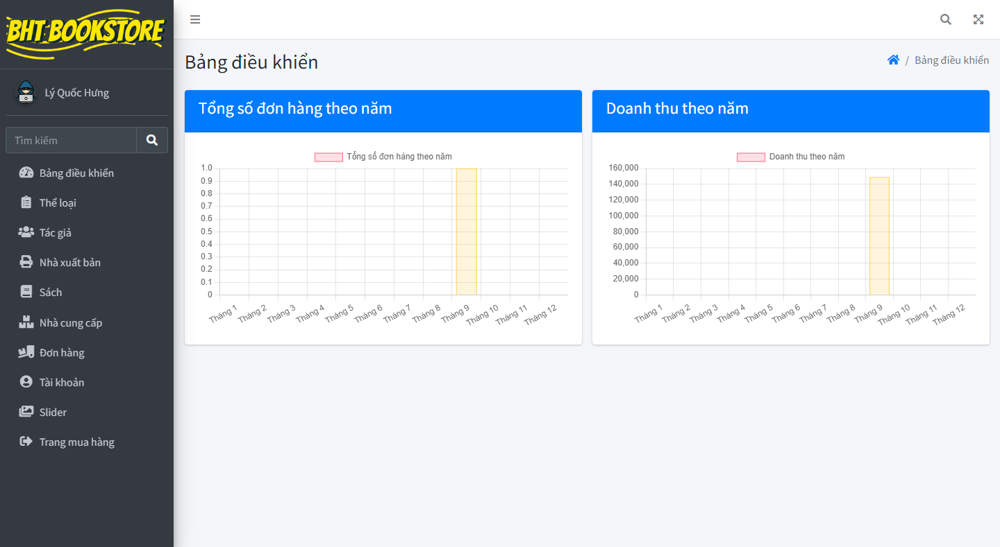

# Website bán sách

## :pushpin: Ngôn ngữ
- [x] HTML
- [x] CSS
- [x] JavaScript
- [x] PHP
- [x] MySQL

## :pushpin: Tính năng

### Quản trị viên hệ thống
- Thể loại (Thêm, sửa, xoá, tìm kiếm).
- Tác giả (Thêm, sửa, xoá, tìm kiếm).
- Nhà xuất bản (Thêm, sửa, xoá, tìm kiếm).
- Sách (Thêm, sửa, xoá, tìm kiếm).
- Nhà cung cấp (Thêm, sửa, xoá, tìm kiếm).
- Slider (Thêm, sửa, xoá, tìm kiếm).
- Đơn hàng (In hoá đơn, thanh toán).
- Tài khoản (khoá tài khoản, đổi mật khẩu, cấp quyền tài khoản).

### Người dùng
- Tìm kiếm sách (theo từ khoá, thể loại).
- Xem thông tin chi tiết sách.
- Giỏ hàng: thêm sách, cập nhật số lượng, xoá sách.
- Tạo đơn hàng.

## Chạy localhost

> php -S localhost:8000

## :framed_picture: Hình ảnh
- Đăng nhập

- Trang chủ

- Quản trị viên
